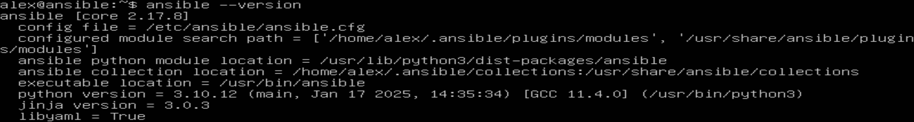

# Automated Web Server Deployment with Ansible

## Table of Contents

1. [Introduction](#introduction)  
   1.1. [Overview of Ansible](#overview-of-ansible)  
   1.2. [Benefits](#benefits)  
2. [Prerequisites](#prerequisites)  
3. [Ansible Configurations](#ansible-configurations)  
   3.1. [SSH Connectivity Between Nodes](#ssh-connectivity-between-nodes)  
   3.2. [Ansible Playbooks](#ansible-playbooks)  
4. [Results](#results)  
5. [Conclusions](#conclusions)  
   5.1. [Key Considerations](#key-considerations)


# Introduction

Automating web server deployment is crucial in modern IT environments. Manual setup and configuration of servers are time-consuming and error-prone, leading to inconsistencies and delays. Infrastructure automation addresses these issues by providing faster, repeatable deployments. In fact, infrastructure automation can yield significant benefits such as time savings, less tedious manual work, and improved overall system health. By automating the provisioning of web servers, organizations can ensure their applications are deployed reliably and efficiently every time. **Ansible** plays a key role in simplifying infrastructure management for web servers. Developed by Red Hat, Ansible has become a *de facto* standard for configuration management, ensuring systems are configured consistently and according to best practices. 
In this project, a single Ansible playbook orchestrates the installation and configuration of Nginx on Ubuntu/CentOS and IIS on Windows, ensuring a standardized deployment across these environments.

## Overview of Ansible

Ansible is a Red-Hat open-source automation tool used for configuration management, application deployment, and orchestration. It uses a declarative approach to manage infrastructure as code (IaC), making system administration tasks more efficient.

## Benefits

- **Agentless Architecture**: Ansible does not require to install agents on remote machines, as it uses SSH connectivity
- **Cross-Platform Compatibility**: Ansible works across Linux and Windows systems.
- **Scalability**: Ansible can automate configuration management for a few machines or thousands.
- **Consistency**: Ansible ensures uniform configurations across all environments.
- **Simplifies Web Server Deployment**: Ansible automates installation and configuration of NGINX, and IIS with minimal effort.

# Prerequisites

For this hands-on project the following items are required:

- A control node running Ansible
- Remote nodes (on this particular project the following remote hosts will be utilized):
    - Ubuntu Server 22.04
    - CentOS 10 (RHEL)
    - Windows Server 2022
- SSH access configured for remote hosts.
- Internet connectivity for package installations.

# Ansible Configurations

This section describes the connectivity process between nodes via SSH, as well as the configuration of Ansible Playbook (yaml file), which will automate and streamline the deployment of web server across different OS.

Before proceeding, make sure that Ansible is properly installed on the control plane via the following command:

```bash
ansible --version
```



We start with the configuration of `ansible.cfg` file. 
In this file, `inventory = hosts` tells Ansible to use a file named `hosts` (located in your project directory) as its default inventory. This way, you do not need to specify the `-i hosts` option every time you run Ansible commands. The line `host_key_checking = False` disables SSH host key checking, which is convenient for development or testing when you frequently connect to new or temporary hosts. In production environments, however, it is typically safer to leave host key checking enabled to detect any unauthorized changes to a host’s fingerprint and reduce security risks.

```bash
[defaults]
inventory = hosts
host_key_checking = False
```

Once the general configuration file is defined, it is time to configure `hosts`file.

In the `[control]` group, the host named `ansible` is set with `ansible_connection=local`, indicating that tasks will run on the control node itself rather than over SSH. This setup is useful if you plan to manage or configure the control node alongside other remote hosts. The `[linux]` group lists two hosts:`ubuntu` and `centos`, so you can easily target both distributions under one group label when writing playbooks. The `[windows]` group contains a single host named `winserver22`, which allows you to keep Windows-specific tasks separate from those intended for Linux. Lastly, `[all:vars]` sets `ansible_python_interpreter=/usr/bin/python3`, ensuring that Ansible uses Python 3 when executing modules on your Linux hosts. This variable section can be extended or overridden if needed for specific hosts, but by default it applies to all of them. 

```bash
[control]
ansible ansible_connection=local

[linux]
ubuntu
centos

[windows]
winserver22

[all:vars]
ansible_python_interpreter=/usr/bin/python3
```

## SSH connectivity between nodes

SSH connectivity between nodes is essential for Ansible to communicate with remote hosts—whether you’re deploying web servers, managing configuration, or running ad-hoc commands. By configuring **key-based authentication**, you eliminate repeated manual password entries and reduce security risks associated with plain-text passwords. In this script, we start by generating an RSA key pair with the `ssh-keygen` command on the Ansible control node, which will be used to authenticate to remote hosts. Next, we install the `sshpass` utility so that Ansible can automate the process of copying our public key without prompting for credentials each time. We create a simple file named `password.txt` containing the SSH password, then loop through each user (`alex` and `root`) and each Linux OS target (`ubuntu` and `centos`) to run `ssh-copy-id`, thereby placing our public key in each server’s authorized keys. The final step handles the Windows Server (`winserver22`) separately, only copying the key for the `alex` user. After the process completes, we remove `password.txt` to avoid leaving sensitive information on disk. Through these steps, every remote machine is set up to accept key-based logins from the control node, simplifying subsequent Ansible runs and making automation both more secure and more convenient.

```bash
# Generate public/private rsa key pair 

ssh-keygen

# Update apt and install `sshpass` (SSH password automation in Linux)

sudo apt update
sudo apt install sshpass

# Create a "password.txt" file that will contain the password for SSH

echo "Ansible123!" > password.txt
 
# Create a series of 'for' loops for the variations of OS to be connected with Ansible host
#Scenario: 2 users (alex, root), 3 OS (ubuntu, centos, winserver22)

for user in alex root
 do
   for os in ubuntu centos
     do
       sshpass -f password.txt ssh-copy-id -o StrictHostKeyChecking=no ${user}@${os}
	   done
   done

# Only run for 'alex' user on winserver22
sshpass -f password.txt ssh-copy-id -o StrictHostKeyChecking=no alex@winserver22   
   
# Delete "password.txt" file   

rm password.txt
```

Once the script execution finishes, try to ping all the machines via ansible:

```bash
ansible linux -m ping && ansible windows -m win_ping
```


NOTE: Windows modules in Ansible must begin with `win_` prefix (else it will throw an error)

## Ansible Playbooks

**Ansible Playbooks** are YAML-based files that describe a series of tasks to be executed on target hosts. They define how those hosts should be provisioned or configured, using human-readable keywords like `hosts`, `tasks`, and `handlers`. 
In the snippet below, the play targets `hosts: linux` and enables privilege escalation with `become: yes`, ensuring system-level tasks (like installing or restarting services) have the necessary permissions. Under `vars`, there are paths for serving content on different Linux distributions:`centos_nginx_root_location` and `ubuntu_nginx_root_location`, plus a `server_type` variable specifying “Nginx.” Within the `tasks` list, the first step installs the EPEL repository if the system is running CentOS, followed by installing Nginx using the default package manager. A `service` task then restarts Nginx and triggers a handler named `Check HTTP Service`. The two template tasks illustrate how Ansible applies conditional logic, copying an HTML file to the correct location depending on whether the distribution is CentOS or Ubuntu. Finally, the `handlers` section includes `Check HTTP Service`, which uses the `uri` module to verify that Nginx is serving HTTP traffic correctly on the local IP address. This overall playbook structure ensures each Linux host ends up with a running Nginx server and a consistent HTML landing page, all defined and executed from one centralized file.

```yaml
- hosts: linux
  become: yes
  
  vars:
    centos_nginx_root_location: /usr/share/nginx/html
    ubuntu_nginx_root_location: /var/www/html
    server_type: "Nginx"

  tasks:
    - name: Install EPEL
      yum:
        name: epel-release
        update_cache: yes
        state: latest
      when: ansible_distribution == 'CentOS'

    - name: Install Nginx
      package:
        name: nginx
        state: latest

    - name: Restart nginx
      service:
        name: nginx
        state: restarted
      notify: Check HTTP Service

    - name: Upload HTML boilerplate on CentOS
      template:
        src: templates/index.html
        dest: "{{ centos_nginx_root_location }}/index.html"
        mode: 0644
      when: ansible_distribution == 'CentOS'

    - name: Upload HTML boilerplate on Ubuntu
      template:
        src: templates/index.html
        dest: "{{ ubuntu_nginx_root_location }}/index.html"
        mode: 0644    
      when: ansible_distribution == 'Ubuntu'

  handlers:
    - name: Check HTTP Service
      uri:
        url: http://{{ ansible_default_ipv4.address }}
        status_code: 200
```

A very similar approach logic and configuration file is applied for Windows Server. 
In the following snippet, the play targets `hosts: windows` and uses `become` with `runas` to run tasks as the `Alex` user, granting the necessary permissions to install and configure IIS. Under `vars`, we define `iis_root_location` as `C:/inetpub/wwwroot`, the default web root on Windows, along with a variable `server_type` set to “IIS”. The tasks illustrate Windows-specific modules: `win_feature` installs the “Web-Server” (IIS) role, including its management tools; `win_service` ensures the `W3SVC` service is running; and `win_template` places a boilerplate HTML file into the IIS root directory. The handler named `Check HTTP Service` uses the same `uri` module as in a Linux play, verifying that the web server responds with a valid HTTP 200 status, thereby confirming IIS is operational.

```yaml
- hosts: windows
  become: yes
  become_method: runas
  become_user: Alex

  vars:
    iis_root_location: "C:/inetpub/wwwroot"
    server_type: "IIS"

  tasks:
    - name: Install IIS Web-Server Role
      win_feature:
        name: Web-Server
        state: present
        include_management_tools: yes

    - name: Ensure IIS service is started
      win_service:
        name: W3SVC
        state: started

    - name: Upload HTML boilerplate for IIS
      win_template:
        src: templates/index.html
        dest: "{{ iis_root_location }}/index.html"

  handlers:
    - name: Check HTTP Service
      uri:
        url: http://{{ ansible_default_ipv4.address }}
        status_code: 200
```

# Results

Running the playbook shows a clear breakdown of each task for both Ubuntu and CentOS hosts. Tasks such as installing EPEL and Nginx were correctly applied or skipped depending on the distribution, and you can see changes reflected in the status lines (e.g., `changed` for tasks that updated the system, `ok` for tasks that were already in the desired state, and `skipping` for tasks not relevant to a particular OS). Finally, the play recap confirms successful execution across both hosts, and the `curl` commands demonstrate that each server correctly serves the boilerplate HTML page. This verifies that Nginx is running as intended and that the customized content has been properly deployed to both Ubuntu and CentOS.


Same exact result is expected when running the playbook against Windows Server. As shown below, browsing to the server displays the HTML boilerplate page, verifying that IIS is properly installed and serving content.


# Conclusions

This project demonstrated how Ansible can unify management and deployment for a mixed-environment setup: Ubuntu, CentOS, and Windows Server, by orchestrating web server installations (Nginx and IIS) from a single control node. By leveraging playbooks that specify tasks conditionally, you achieved consistent, repeatable deployments without manual, OS-specific procedures. Each host now runs a fully automated configuration process that ensures proper installation, service startup, and delivery of a custom index page. The success of these playbooks, validated by the final output and browser checks, confirms that Ansible’s agentless model and declarative playbooks simplify operational workflows while reducing human error. Overall, this approach not only saves time but also scales easily, making it straightforward to add more servers or extend the deployment for future projects.

## Key Considerations

When deploying across multiple platforms, be mindful of OS-specific differences, such as package managers (`apt` vs. `yum`) or service names for Windows and Linux. Keep security practices in check—like limiting `host_key_checking = False` to non-production environments to prevent accidental connections to spoofed hosts. For Windows automation via SSH, confirm that OpenSSH is correctly installed and configured, and consider the trade-offs compared to WinRM. It’s also best to maintain separate variables or group-specific playbook sections so you can easily customize configurations for each OS. Finally, thorough testing in a staging environment is essential before rolling out changes to production; this ensures that subtle differences in firewall settings, file permissions, or service dependencies are addressed without risking downtime.
